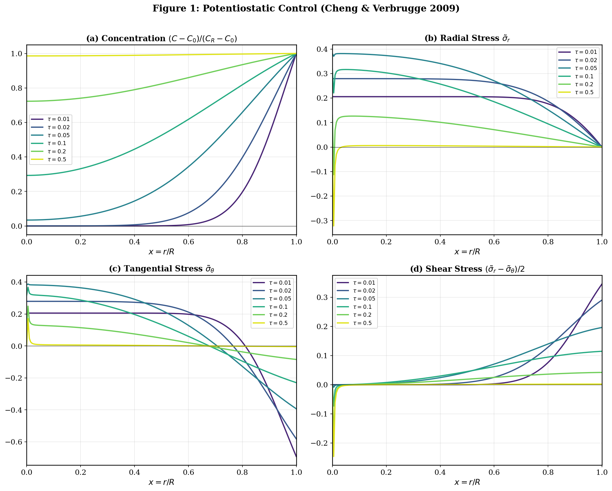
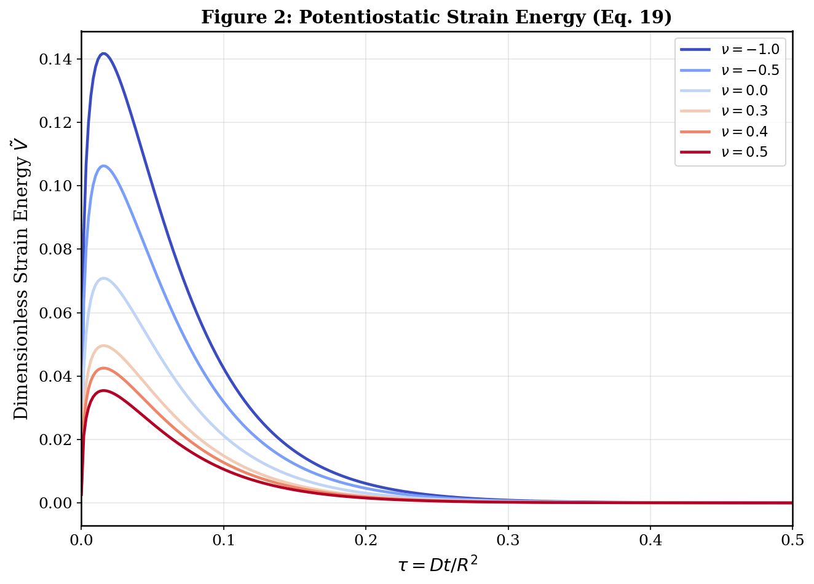
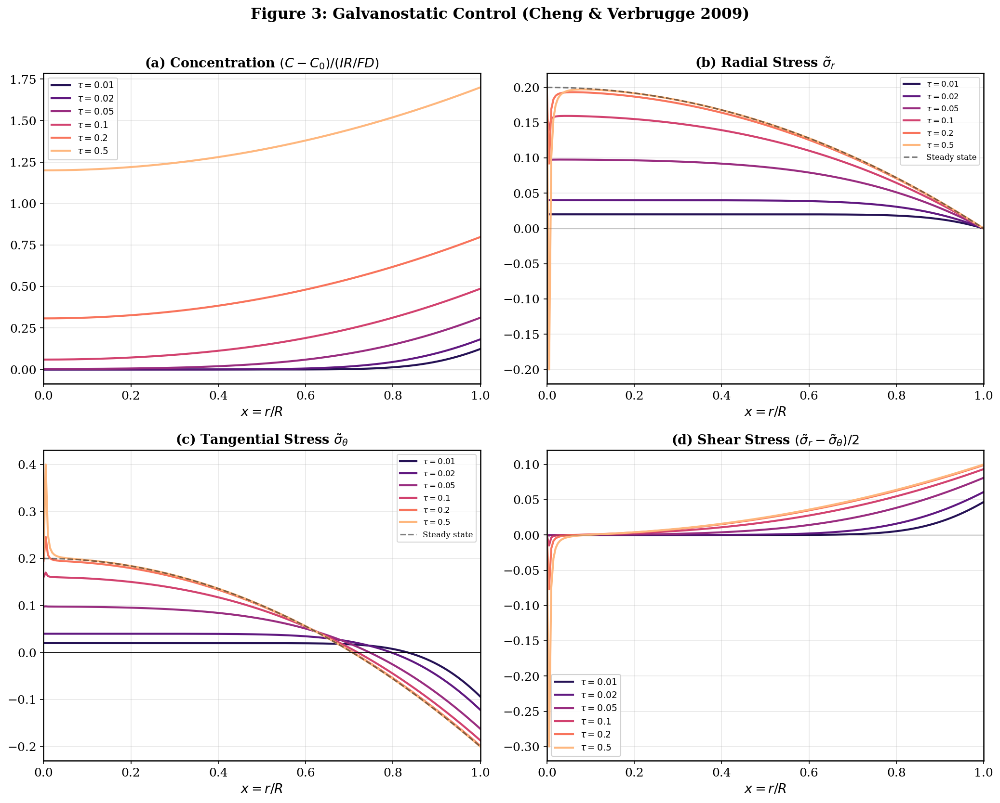
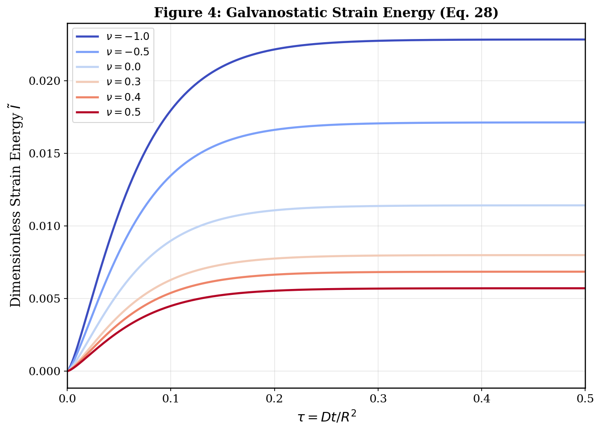
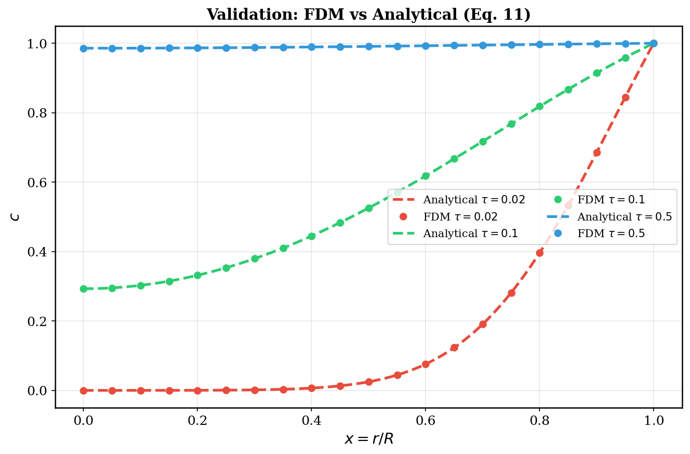

# Diffusion-Induced Stresses in Spherical Electrode Particles

Numerical reproduction of **Cheng & Verbrugge (2009)** — *"Evolution of stress within a spherical insertion electrode particle under potentiostatic and galvanostatic operation"*, Journal of Power Sources **190**, 453–460.

---

## Overview

This project solves the solid-state diffusion equation inside a spherical insertion electrode particle using the **Finite Difference Method (FDM)** with a **Crank-Nicolson** scheme, then computes the resulting diffusion-induced **radial**, **tangential**, and **shear stresses**, as well as the **total elastic strain energy**.

Both **potentiostatic** (constant surface concentration) and **galvanostatic** (constant surface flux) boundary conditions are implemented, reproducing **Figures 1–4** from the original paper.

## Key Results

### Figure 1 — Potentiostatic: Concentration & Stress Profiles
Concentration increases with time from the surface inward. Radial stress is tensile at the center and zero at the surface. Tangential stress is compressive at the surface (max at $t = 0$) and tensile at the center. Stresses peak transiently then decay.

<p align="center">
  
</p>

### Figure 2 — Potentiostatic: Strain Energy vs Time
Total dimensionless strain energy peaks early then decays to zero as concentration equilibrates. Lower Poisson ratios produce higher strain energy.

<p align="center">
  
</p>

### Figure 3 — Galvanostatic: Concentration & Stress Profiles
Under constant flux, stresses increase monotonically and approach a steady-state given by Eqs. 25–26 of the paper (shown as dashed lines). This is fundamentally different from the potentiostatic case.

<p align="center">
  
</p>

### Figure 4 — Galvanostatic: Strain Energy vs Time
Unlike the potentiostatic case, strain energy increases monotonically to a finite steady-state value.

<p align="center">
  
</p>

### Validation: FDM vs Analytical Solution
The Crank-Nicolson FDM solution matches the analytical series solution (Eq. 11 of the paper) to $O(10^{-5})$.

<p align="center">
  
</p>

| $\tau$ | Max Absolute Error |
|--------|-------------------|
| 0.02   | 9.47 × 10⁻⁵      |
| 0.10   | 3.02 × 10⁻⁵      |
| 0.50   | 2.05 × 10⁻⁶      |

## Verified Against Paper Predictions

| Paper Equation | Prediction | FDM Result |
|----------------|-----------|------------|
| Eq. 16: Max $\tilde{\sigma}_r$ at center | ≈ 0.4 at $\tau$ = 0.0574 | **0.3856 at $\tau$ = 0.0574** |
| Eq. 17: $\tilde{\sigma}_\theta$ at surface ($t \to 0$) | −1.0 | **−0.9894** |
| Eq. 25: Galvanostatic steady-state $\tilde{\sigma}_r(0)$ | 0.2 | **0.2001** |
| Eq. 26: Galvanostatic steady-state $\tilde{\sigma}_\theta(1)$ | −0.2 | **−0.1999** |

## Mathematical Formulation

### Governing Equation
1D spherical diffusion in dimensionless form ($x = r/R$, $\tau = Dt/R^2$):

$$\frac{\partial c}{\partial \tau} = \frac{1}{x^2}\frac{\partial}{\partial x}\left(x^2 \frac{\partial c}{\partial x}\right) = \frac{\partial^2 c}{\partial x^2} + \frac{2}{x}\frac{\partial c}{\partial x}$$

### Boundary Conditions

| Condition | Center ($x=0$) | Surface ($x=1$) |
|-----------|----------------|-----------------|
| **Potentiostatic** | $\partial c/\partial x = 0$ — **Neumann** (symmetry) | $c = 1$ — **Dirichlet** (fixed concentration) |
| **Galvanostatic** | $\partial c/\partial x = 0$ — **Neumann** (symmetry) | $\partial c/\partial x = 1$ — **Neumann** (fixed flux) |

> **Dirichlet BC** prescribes the *value* of the unknown ($c = \text{const}$).
> Used at the surface for potentiostatic control, where the electrode voltage fixes the surface concentration.
>
> **Neumann BC** prescribes the *derivative* (flux) of the unknown ($\partial c/\partial x = \text{const}$).
> Used at the center (zero flux by symmetry) and at the surface for galvanostatic control, where the applied current fixes the surface flux via $D\,\partial C/\partial r|_{r=R} = I/F$.

### Stress Formulas (Paper Eq. 3)
Normalized by $E\Omega\Delta c / [3(1-\nu)]$:

$$\tilde{\sigma}_r = \frac{2}{3}[\bar{c}(1) - \bar{c}(x)], \quad \tilde{\sigma}_\theta = \frac{1}{3}[2\bar{c}(1) + \bar{c}(x) - 3c(x)]$$

where $\bar{c}(x) = (3/x^3)\int_0^x x'^2 c(x') dx'$ is the volume-averaged concentration.

### Numerical Method
- **Crank-Nicolson** time discretization (unconditionally stable, 2nd-order)
- **Central finite differences** in space (2nd-order)
- **L'Hôpital's rule** at $x = 0$ to handle the coordinate singularity
- **Ghost-point method** for Neumann BC (galvanostatic surface flux)

## Repository Structure

```
├── Cheng_Verbrugge_2009_Reproduction.ipynb   # Main notebook (executed, with plots)
├── FDM_Derivation_Document.md                # Full mathematical derivation
├── FDM_Derivation_Document.pdf               # PDF version of derivation
├── fig1_potentiostatic.png                   # Figure 1 output
├── fig2_strain_energy_potentiostatic.png     # Figure 2 output
├── fig3_galvanostatic.png                    # Figure 3 output
├── fig4_strain_energy_galvanostatic.png      # Figure 4 output
├── fig_validation.png                        # FDM vs analytical validation
├── build_notebook_v2.py                      # Notebook generator script
├── generate_pdf.py                           # PDF derivation generator
└── README.md                                 # This file
```

## Requirements

- Python 3.8+
- NumPy
- Matplotlib
- Jupyter (to run the notebook interactively)

```bash
pip install numpy matplotlib jupyter
```

## Usage

### Run the notebook
```bash
jupyter notebook Cheng_Verbrugge_2009_Reproduction.ipynb
```

### Execute from command line
```bash
jupyter nbconvert --to notebook --execute Cheng_Verbrugge_2009_Reproduction.ipynb
```

### Regenerate the notebook
```bash
python build_notebook_v2.py
```

## References

1. **Y.-T. Cheng, M.W. Verbrugge**, "Evolution of stress within a spherical insertion electrode particle under potentiostatic and galvanostatic operation," *J. Power Sources* **190** (2009) 453–460. [DOI: 10.1016/j.jpowsour.2009.01.021](https://doi.org/10.1016/j.jpowsour.2009.01.021)

2. **H.S. Carslaw, J.C. Jaeger**, *Conduction of Heat in Solids*, 2nd ed., Clarendon Press, Oxford, 1959. — Analytical solutions for diffusion in a sphere (Eqs. 11, 20 of the paper).

3. **S.P. Timoshenko, J.N. Goodier**, *Theory of Elasticity*, 3rd ed., McGraw-Hill, 1970. — Stress and strain energy formulations for elastic spheres.

4. **R.J. LeVeque**, *Finite Difference Methods for Ordinary and Partial Differential Equations*, SIAM, 2007. — Crank-Nicolson scheme theory and stability analysis.

5. **J. Crank**, *The Mathematics of Diffusion*, 2nd ed., Clarendon Press, Oxford, 1975. — Finite difference methods for diffusion problems.

## License

This project is for educational and research purposes. The original paper is by Y.-T. Cheng and M.W. Verbrugge (General Motors R&D Center).
